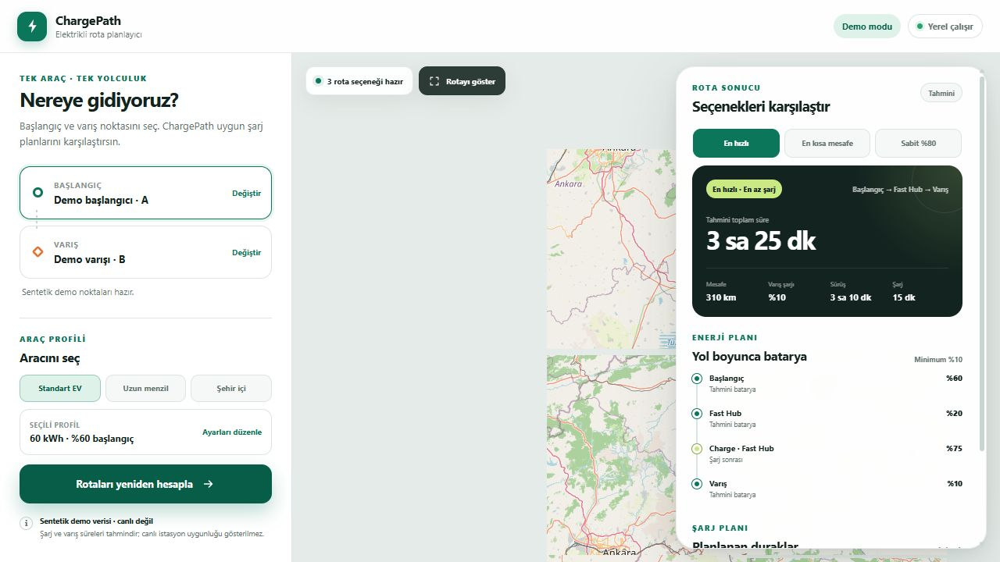
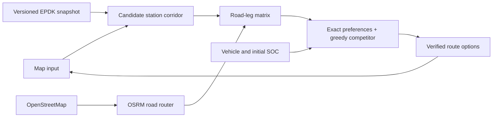

# ChargePath EV Route Optimizer

ChargePath is a local-first portfolio project that chooses feasible charging stops and charging amounts for a single battery-electric car, while delegating road-network geometry to a configured OpenStreetMap routing engine.

> **Status:** M0 through M5 are complete; 0.1.0 has passed the exact Windows and Ubuntu CI matrix. The deterministic optimization core, competitive route
> options, independent replay, schema-versioned synthetic demo, explicit OSRM route/table adapter,
> observed-schema EPDK normalizer, static public CCS2 DC projection, and deterministic corridor
> selector are runnable. The fixture-first loopback Leaflet demo exposes verified route options,
> charging actions, and estimated SOC without requiring OSRM or EPDK network access. Final M5 status
> is independently verified by the [published CI run](https://github.com/EfeErim/chargepath-ev-route-optimizer/actions/runs/31600469029).

## Demo

Windows'ta tek tıkla açmak için kökteki `ChargePath.cmd` dosyasına çift tıklayın. Bu başlatıcı
halka açık OSRM modunu arka planda çalıştırır ve uygulamayı doğru yerel adreste tarayıcıda açar.
`src/chargepath/web/index.html` tek başına açılmaz; sayfa planlama API'sini yerel sunucudan alır.

Start the local map demo and open `http://127.0.0.1:8743`:

```powershell
python -m chargepath.demo
```

Fixture mode is the default. It loads `data/sample/synthetic_corridor.json` through the same strict
loader used by tests, binds only to loopback, and needs no OSRM or EPDK network access. It presents
selectable verified route options, charging actions, estimated SOC, explicit static-data labels, and
an inspectable route even when the basemap is unavailable. See the [map demo guide](docs/map_demo.md)
for integration-mode inputs and network boundaries.

To select arbitrary origin and destination points in this checkout, start the explicit integration
launcher. It uses local OSRM by default; `-UsePublicOsrm` is an explicit remote-provider opt-in that
warns before selected coordinates leave the machine:

```powershell
.\scripts\start_custom_map.ps1 -UsePublicOsrm
```



The command-line demo remains available:

```powershell
python examples/run_synthetic_demo.py
```

## Problem

A normal shortest road route can be infeasible for an EV. The planner must jointly decide:

- which charging stations to visit;
- how much energy to add at each stop;
- whether every road leg preserves a minimum battery reserve; and
- which feasible plan minimizes driving plus charging time.

This repository treats the task as a **resource-constrained shortest-path problem with resource-recovering nodes**. It does not attempt to rebuild a national road router.

## Decision produced by the system

For one origin, destination, vehicle profile, and candidate-station set, ChargePath can return
deduplicated options selected by fastest-time, shortest-distance, fewest-session, and greedy fixed-80
strategies. Every returned option includes:

- the ordered road legs;
- charging stops and energy added at each stop;
- CCS2 DC compatibility enforcement;
- arrival and departure SOC estimates;
- driving, charging, and total trip time; and
- an explicit infeasible result when the reserve constraint cannot be satisfied.

Different strategies may select the same actionable plan. In that case the plan appears once with
multiple strategy aliases; the project does not manufacture cosmetic alternatives.

## Architecture



The boundary is intentional: OSRM answers “how do I drive from A to B?”, while ChargePath answers
“which charging sequences are feasible, and which one best matches each declared objective for this
vehicle?”. See [architecture](docs/architecture.md) and [algorithm design](docs/algorithm.md).

## Data

- **Road graph and geometry:** OpenStreetMap through OSRM.
- **Charging stations:** versioned EPDK snapshot ingestion with immutable provenance, while real rows
  remain outside Git pending explicit reuse/redistribution permission.
- **Vehicle profile:** explicit usable battery, initial SOC, consumption, reserve SOC, maximum DC
  charging power, and supported DC connectors.
- **Bundled sample:** synthetic test data only.

See [data strategy](docs/data_strategy.md) and [data dictionary](docs/data_dictionary.md).

## Method

The exact solver uses Dijkstra's label-setting algorithm over `(location, energy bucket)` states:

- driving consumes conservatively rounded energy buckets;
- charging stations create transitions to higher SOC levels;
- incompatible connectors create no charging transition;
- charging time is piecewise linear, with slower charging above the taper threshold;
- every driven transition must retain the configured reserve; and
- lexicographic preferences optimize time, distance, or charging-session count without hidden
  weighted sums.

A separate greedy competitor follows the shortest-driving-time path, charges toward 80% when
blocked, and can explicitly report that it failed even when exact search succeeds.

The initial research and design rationale are documented in [research](docs/research.md), with
external evidence indexed in the [source registry](docs/source_registry.md).

## Route strategies and evaluation

The runnable option planner currently compares:

1. exact fastest total trip time;
2. exact shortest feasible road distance;
3. exact fewest charging sessions, with time and distance tie-breaks; and
4. a deterministic greedy policy that charges once toward a fixed 80% target.

The exact strategies share the legal state graph with different lexicographic objectives; the greedy
strategy is a separate heuristic and can explicitly fail when exact search succeeds. The M3 suite
covers eight hand-audited synthetic topology/boundary cases. All 22 returned plans replayed with zero
reserve violations and no false-feasible result. On the three charging cases, exact fastest-time was
4.8 modeled minutes faster than fixed-80 greedy because it stopped charging earlier. This is a narrow
synthetic-suite result, not a real-world superiority claim. See the
[experiment plan](docs/experiment_plan.md) and generated [results](docs/results.md).

## Setup

The reviewed release environments are CPython 3.11.9 on Windows 2025 and Ubuntu 24.04 x64. Create a
fresh environment and install the exact verification graph.

Windows PowerShell:

```powershell
py -3.11 -m venv .venv
.\.venv\Scripts\Activate.ps1
python -m pip install --upgrade "pip==26.2" "setuptools==83.0.0"
python -m pip install --constraint constraints/release-py311.txt --editable ".[dev]"
```

Ubuntu with PowerShell 7 available for the canonical gate:

```bash
python3.11 -m venv .venv
source .venv/bin/activate
python -m pip install --upgrade "pip==26.2" "setuptools==83.0.0"
python -m pip install --constraint constraints/release-py311.txt --editable ".[dev]"
```

Run the deterministic demo:

```powershell
python examples/run_synthetic_demo.py
```

Run the local fixture-first map demo:

```powershell
python -m chargepath.demo
```

Run checks:

```powershell
.\scripts\check.ps1
```

Regenerate the offline M3 evidence:

```powershell
python scripts/run_m3_benchmark.py --warmups 3 --repetitions 20
```

The check script prefers the repository virtual environment and runs unit tests, byte-compilation,
the offline demo, Ruff lint/format checks, strict mypy checks, `pip check`, and the fail-closed release
allowlist/secret/large-file audit. It also builds the release wheel, checks its web assets, fixture,
MIT/third-party notices, installs it non-editably into a new environment, and runs the fixture service
from outside the repository.

The commands above are locally verified on Windows. The checked-in CI uses the same gate on the exact
`windows-2025` and `ubuntu-24.04` runner labels; green remote results are not claimed before the
candidate is explicitly committed and published. See the [release evidence and procedure](docs/release.md).

Optional self-hosted OSRM setup and its loopback-default boundary are documented in
[local OSRM setup](docs/osrm_setup.md). Explicit map integration configuration is documented in the
[map demo guide](docs/map_demo.md). The fixture map flow, CLI demo, and canonical checks do not
require OSRM or EPDK network access.

## Current limitations

- Road legs in the default map demo remain synthetic. Explicit integration mode builds candidate
  legs from OSRM Table output and fetches each distinct selected directed-leg geometry once. Its
  candidate cap bounds Table size and therefore the distinct station nodes available to a plan; the
  optimizer itself has no separate one-stop or fixed stop-count rule. In local OSRM mode only, an
  infeasible capped search expands the deterministic candidate set up to a configured local limit
  before it reports no route. Remote OSRM mode keeps its explicit initial cap to avoid unbounded
  third-party requests.
- The energy model uses constant consumption with a configurable safety factor; elevation, weather, speed, temperature, and regenerative braking are not modeled.
- Charging power is a simplified piecewise curve, not a vehicle-specific measured curve.
- EPDK access and one observed schema were verified on 2026-08-09; quota, source freshness,
  cross-snapshot identifier behavior, and data-reuse conditions remain explicitly unresolved.
- The first release models CCS2 DC charging only.
- No live occupancy, outage, price, traffic, or route replanning is claimed.
- A discrete SOC grid trades precision for a small and explainable state space. The demo first uses
  5% buckets and, only after a coarse infeasible result, retries at 2%. Results visibly report when
  this refinement was required; the model remains discrete rather than continuous battery physics.
- Route options are alternatives under the declared model objectives; they are not live traffic,
  charger-availability, safety, or reliability recommendations.

See [limitations](docs/limitations.md) for the full boundary.

## Roadmap

- **M0–M0.2 — Foundation:** deterministic core, independent replay, connector checks, typed synthetic
  fixture, exact objective variants, greedy competitor, and deduplicated route options.
- **M1 — Road adapter (complete):** loopback-default OSRM route/table integration with a
  version-pinned recorded fixture.
- **M2 — Station data (complete):** schema-guarded EPDK normalization, provenance/reconciliation,
  public CCS2 DC projection, and deterministic capped corridor filtering.
- **M3 — Planner evaluation (complete):** checksum-pinned synthetic benchmark, deterministic
  baselines, independent replay, strategy comparison, SOC-grid sensitivity, pruning audit, and
  median/p95 runtime evidence.
- **M4 — Map demo (complete):** loopback-only fixture-first Leaflet interface, explicit static-data
  and estimate labels, selectable route options, failure states, and captured UI evidence.
- **M5 — Portfolio release candidate:** clean install, pinned cross-platform CI, evidence, final
  README/media, licensing/attribution, and a fail-closed release-content audit. Publication and remote
  CI remain approval-gated.

Detailed gates are in [PROJECT_PLAN.md](PROJECT_PLAN.md); current evidence is in [PROJECT_STATE.md](PROJECT_STATE.md).

## Research sources

The literature review prioritizes primary papers and official service documentation. Start with:

- Baum et al., “Shortest Feasible Paths with Charging Stops for Battery Electric Vehicles” ([DOI](https://doi.org/10.1287/trsc.2018.0889)).
- Merting et al., “Routing of Electric Vehicles: Constrained Shortest Path Problems with Resource Recovering Nodes” ([paper](https://drops.dagstuhl.de/entities/document/10.4230/OASIcs.ATMOS.2015.29)).
- Artmeier et al., “The Shortest Path Problem Revisited: Optimal Routing for Electric Vehicles” ([publication page](https://www.isp.uni-luebeck.de/research/publications/shortest-path-problem-revisited-optimal-routing-electric-vehicles)).
- [OSRM](https://project-osrm.org/) and [OpenStreetMap tile policy](https://operations.osmfoundation.org/policies/tiles/).
- [EPDK charging-station web services](https://www.epdk.gov.tr/Detay/Icerik/3-0-226/web-servisler).

The [source registry](docs/source_registry.md) records verification dates, project use, and the limits
of each external source.

## License

ChargePath's project-authored code and documentation are released under the [MIT License](LICENSE).
External software, services, and data retain their own terms; see the
[third-party notices](THIRD_PARTY_NOTICES.md). No real EPDK rows or OpenStreetMap extract is included
in the release candidate.
