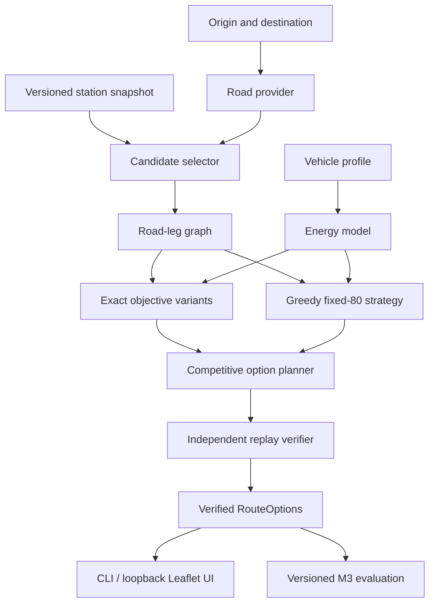

# Architecture

## Design goal

Keep the portfolio decision logic visible: road routing is a provider, while EV feasibility and charging decisions remain in a deterministic Python core.

## Components



### Domain core

`src/chargepath/models.py`

- immutable vehicle, station, road-leg, charging-stop, and route-plan contracts;
- typed GeoJSON LineString geometry using WGS84 `longitude,latitude` positions;
- first-release CCS2 DC compatibility on both vehicle and station contracts;
- validation at construction boundaries;
- no network or UI dependency.

### Energy model

`src/chargepath/energy.py`

- distance-to-energy calculation;
- SOC/kWh conversion;
- conservative conversion to discrete energy buckets;
- piecewise charging-time calculation.

### Optimizer

`src/chargepath/optimizer.py`

- exact label-setting/Dijkstra search over `(node, energy_bucket)`;
- lexicographic fastest-time, shortest-distance, and fewest-charging-session preferences;
- drive and charge transitions;
- reserve-SOC invariant;
- explicit `NoFeasibleRouteError`;
- action reconstruction into an explainable `RoutePlan`.

### Competitive route options

`src/chargepath/alternatives.py`

- runs the three exact objective preferences plus a separate fixed-80% greedy heuristic;
- reuses immutable per-leg energy-bucket calculations across those four strategies;
- verifies every candidate plan before returning it;
- merges identical actionable plans while retaining all selecting strategy identifiers;
- exposes heuristic or strategy failures instead of silently pretending every strategy succeeded.

### Verification

`src/chargepath/verification.py`

- replays charge and drive actions independently of optimizer predecessor state;
- recomputes conservative energy buckets, charge time, and reserve checks;
- rejects incompatible charging, inconsistent SOC, or tampered output.

### Planner evaluation

`src/chargepath/baselines.py` owns the deterministic shortest-driving-time/no-charging baseline.
`src/chargepath/evaluation.py` loads the checksum-pinned synthetic M3 manifest, runs both baselines and
all exact preferences, independently verifies every returned plan, normalizes byte-stable correctness
results, audits SOC-grid sensitivity and corridor pruning, and records a separate machine-specific
median/p95 runtime artifact. Benchmark execution is offline and does not enter the domain core.

### Local map application

`src/chargepath/demo.py` is the M4 application boundary. Its standard-library HTTP server binds only
to `127.0.0.1`, validates a small bounded JSON contract, and serves packaged HTML/CSS/JavaScript.
The fixture service composes the existing loader, static road network, competitive planner, and
typed GeoJSON without provider calls. The explicit integration service composes the checksum-guarded
EPDK normalizer, deterministic corridor selector, OSRM Table graph, competitive planner, and
selected-leg Route geometry. Neither service is imported by the domain core.

`src/chargepath/web/` owns presentation only: Leaflet point selection, route/stop drawing, selectable
option cards, estimated SOC/charging explanations, and user-visible loading/empty/failure/basemap
states. It does not calculate feasibility or advance the optimizer.

### Road providers

`src/chargepath/providers/`

- `StaticRoadNetwork` is the deterministic optimizer-facing graph provider;
- `OsrmHttpClient` implements separate route/table protocols behind an injected HTTP transport;
- `CandidateGraphBuilder` converts asymmetric Table cells into optimizer road legs and leaves `null`
  pairs unreachable; OSRM's single-decimal `-0.1` negative-zero artifact is clamped to zero, and
  rounded zero-length non-diagonal cells are omitted rather than becoming invalid drive legs;
- the table client supplies fastest-route distance/duration pairs, while selected-plan geometry is
  fetched after optimization; each distinct directed leg is requested at most once across options,
  with at most four independent geometry requests in flight;
- the optimizer sees road legs, not HTTP responses.

### Station-data pipeline

Implemented M2 layers:

1. immutable raw source response outside Git;
2. retrieval manifest with URL, timestamp, checksum, and access notes;
3. normalized station and socket rows;
4. validation report for coordinates, connectors, power, and duplicates;
5. small license-safe sample fixture in Git.

`src/chargepath/station_data.py` owns the observed response contract, reconciliation, immutable
site/socket provenance, and public CCS2 DC projection. Multiple source sockets remain normalized
rows; one optimizer station option per public site uses their maximum compatible power while retaining
the contributing source socket identifiers.

`src/chargepath/corridor.py` performs deterministic geometric pruning before OSRM candidate-graph
construction. Its configuration records the 25 km default width, 50-candidate cap, prefix-monotonic
farthest-progress coverage policy, two-percent gap tolerance, ordered ranking keys, algorithm version,
and stable-identifier final tie-break. Larger caps retain every smaller-cap choice. The cap controls
candidate-graph/Table size and therefore available distinct station nodes; it is not a second stop-
count constraint inside the optimizer. Route segment lengths and conservative search bounds are
prepared once per request. The optimizer still verifies connector support, and OSRM still owns road
reachability and costs.

## Dependency direction

```text
UI / CLI
   -> application orchestration
      -> competitive option planner
         -> exact optimizer + greedy strategy + independent verifier
      -> energy + domain models
      -> provider protocols
         -> OSRM / station-source adapters
```

The domain core must never import a web framework, map library, or HTTP client.

## Runtime modes

### Offline verification

- static road legs;
- synthetic stations;
- no network;
- authoritative for unit tests and algorithm regression.

### Fixture demo

- the schema-versioned synthetic JSON is the only data source for the CLI and default map UI flow;
- routing, station selection, and plan explanation work without OSRM or EPDK network access;
- a missing tile layer may reduce map context but must not block the fixture flow.

For source/editable execution the JSON is read from `data/sample/`. The wheel installs those exact
bytes under `share/chargepath/`, allowing the same default flow to run outside a repository checkout.

### Local integration

- local OSRM instance or explicitly configured endpoint, with loopback as the default;
- versioned station snapshot;
- the same Leaflet presentation behind an explicitly selected integration mode;
- no production availability claim.

## Error boundaries

- invalid domain data raises `ValueError` at construction;
- missing road connections produce an explicit infeasible result;
- provider timeouts and malformed responses remain provider errors, not fake empty routes;
- OSRM `null` matrix cells become explicit unreachable pairs, never zero-cost legs;
- station freshness is metadata and must be shown by the future UI.
